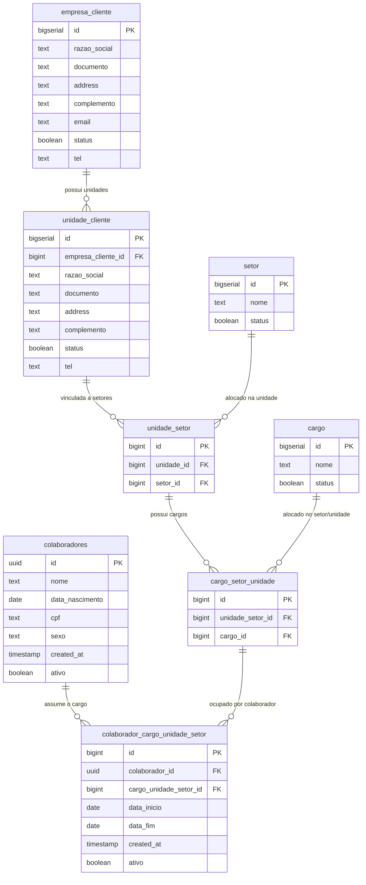

create table public.cargo (
  id bigserial not null,
  nome text not null,
  status boolean not null default true,
  constraint cargo_pkey primary key (id)
) TABLESPACE pg_default;

-------------------------------------------------------------------------

create table public.cargo_setor_unidade (
  id bigint generated always as identity not null,
  unidade_setor_id bigint not null,
  cargo_id bigint not null,
  constraint cargo_setor_unidade_pkey primary key (id),
  constraint cargo_setor_unidade_unidade_setor_id_cargo_id_key unique (unidade_setor_id, cargo_id),
  constraint cargo_setor_unidade_cargo_id_fkey foreign KEY (cargo_id) references cargo (id),
  constraint cargo_setor_unidade_unidade_setor_id_fkey foreign KEY (unidade_setor_id) references unidade_setor (id)
) TABLESPACE pg_default;

---------------------------------------------------------------------------

create table public.colaborador_cargo_unidade_setor (
  id bigint generated always as identity not null,
  colaborador_id uuid not null,
  cargo_unidade_setor_id bigint not null,
  data_inicio date not null default CURRENT_DATE,
  data_fim date null,
  created_at timestamp with time zone null default now(),
  ativo boolean null,
  constraint colaborador_cargo_unidade_setor_pkey primary key (id),
  constraint colaborador_cargo_unidade_setor_cargo_unidade_setor_id_fkey foreign KEY (cargo_unidade_setor_id) references cargo_setor_unidade (id),
  constraint colaborador_cargo_unidade_setor_colaborador_id_fkey foreign KEY (colaborador_id) references colaboradores (id)
) TABLESPACE pg_default;

---------------------------------------------------------------------------

create table public.colaboradores (
  id uuid not null default extensions.uuid_generate_v4 (),
  nome text not null,
  data_nascimento date not null,
  cpf text not null,
  sexo text not null,
  created_at timestamp with time zone not null default now(),
  ativo boolean not null,
  constraint colaboradores_pkey primary key (id)
) TABLESPACE pg_default;

---------------------------------------------------------------------------

create table public.empresa_cliente (
  id bigserial not null,
  razao_social text not null,
  documento text null,
  address text null,
  complemento text null,
  email text null,
  status boolean not null default true,
  tel text null,
  constraint empresa_cliente_pkey primary key (id)
) TABLESPACE pg_default;

---------------------------------------------------------------------------

create table public.setor (
  id bigserial not null,
  nome text not null,
  status boolean not null default true,
  constraint setor_pkey primary key (id)
) TABLESPACE pg_default;

---------------------------------------------------------------------------

create table public.unidade_cliente (
  id bigserial not null,
  razao_social text not null,
  documento text null,
  address text null,
  complemento text null,
  status boolean not null default true,
  tel text null,
  empresa_cliente_id bigint not null,
  constraint unidade_cliente_pkey primary key (id),
  constraint unidade_cliente_empresa_cliente_id_fkey foreign KEY (empresa_cliente_id) references empresa_cliente (id) on update CASCADE on delete RESTRICT
) TABLESPACE pg_default;

---------------------------------------------------------------------------------

create table public.unidade_setor (
  id bigint generated always as identity not null,
  unidade_id bigint not null,
  setor_id bigint not null,
  constraint unidade_setor_pkey primary key (id),
  constraint unidade_setor_unidade_id_setor_id_key unique (unidade_id, setor_id),
  constraint unidade_setor_setor_id_fkey foreign KEY (setor_id) references setor (id),
  constraint unidade_setor_unidade_id_fkey foreign KEY (unidade_id) references unidade_cliente (id)
) TABLESPACE pg_default;

-----------------------------------------------------------------------------------

## Diagrama Entidade-Relacionamento

